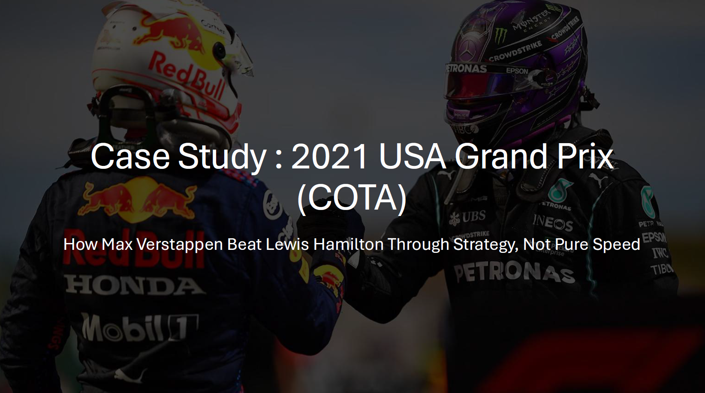
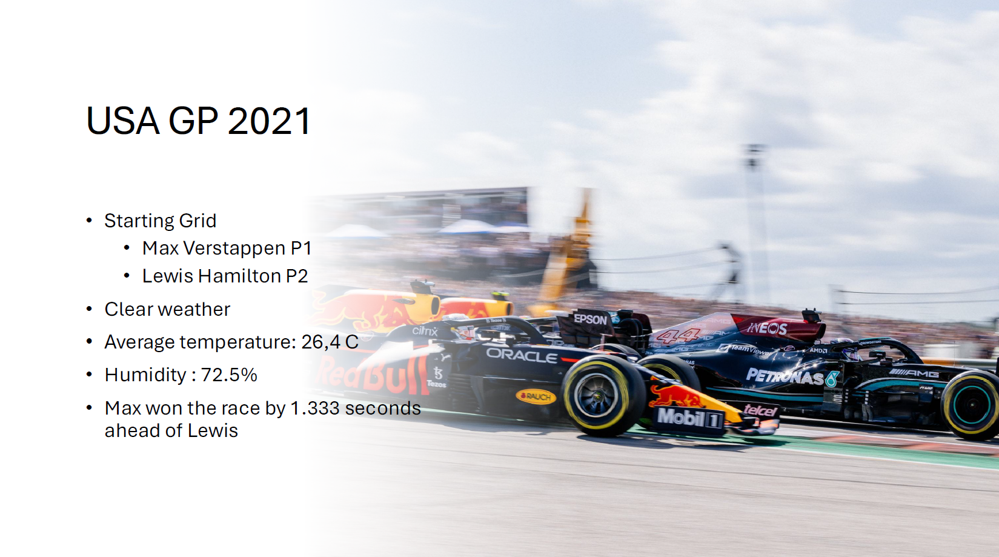
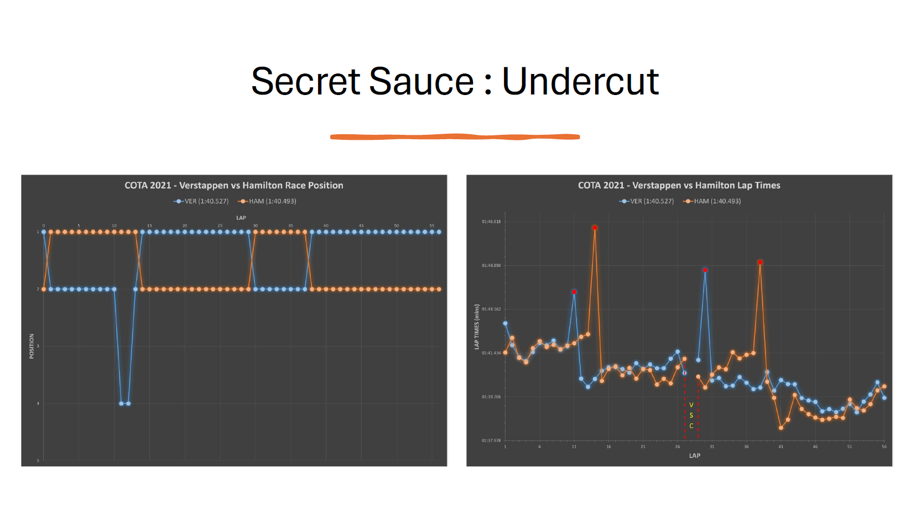
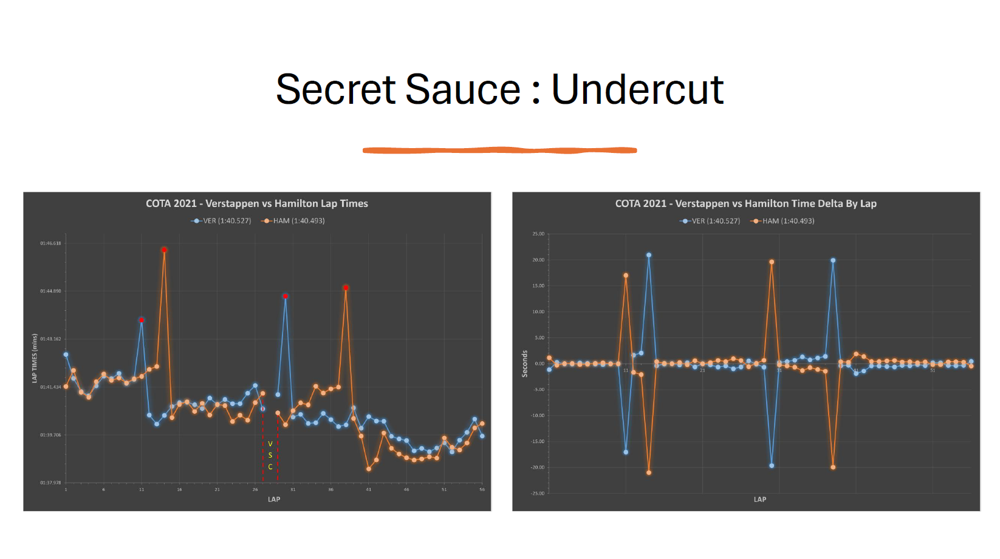
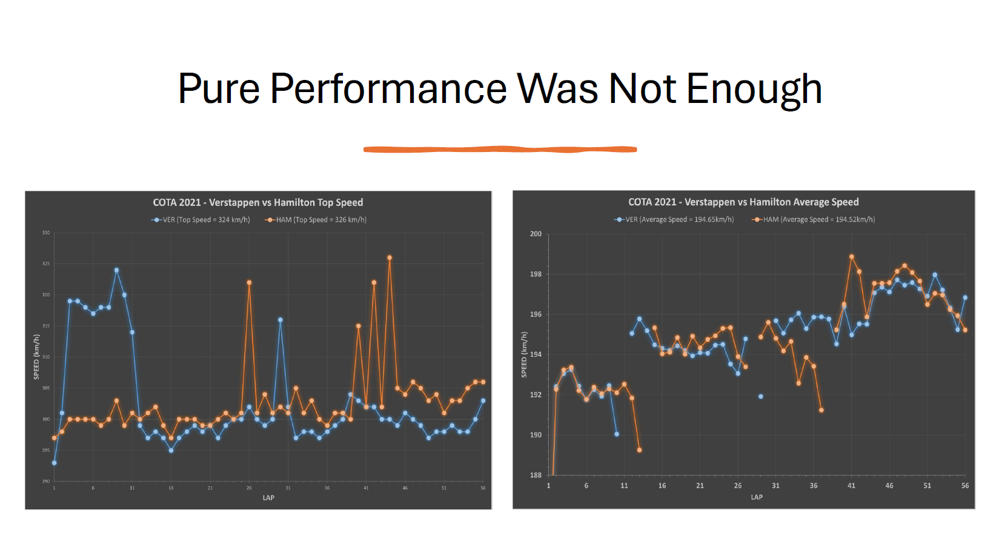
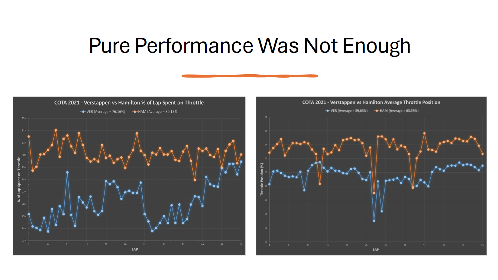
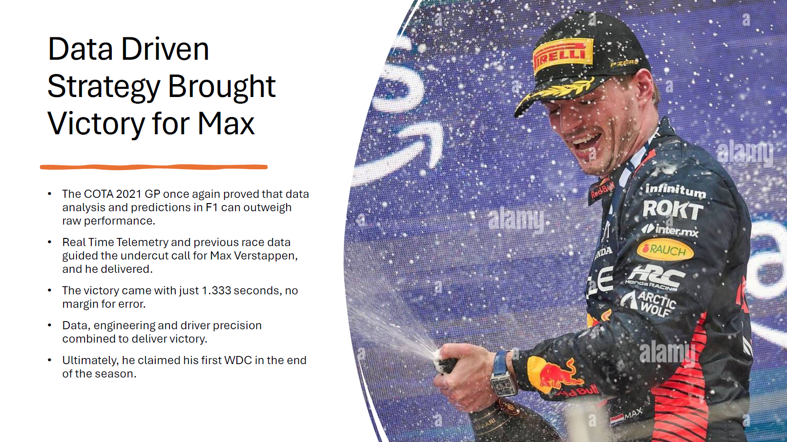

# Formula 1 | Data-Driven Race Strategy Analysis — 2021 USA Grand Prix (COTA)

> *"How Max Verstappen Beat Lewis Hamilton Through Strategy, Not Pure Speed"*

---

## Overview

A lap-by-lap telemetry and race strategy analysis of the **2021 USA Grand Prix at Circuit of the Americas (COTA)**. The project reconstructs the race from raw telemetry data — lap times, positions, pit stop windows, speed, and throttle data — to explain how Red Bull's data-driven undercut strategy handed Verstappen a race victory over Hamilton despite Mercedes holding a marginal raw speed advantage.

---

## Race Context

| Parameter | Value |
|-----------|-------|
| Circuit | Circuit of the Americas (COTA), Austin TX |
| Date | October 24, 2021 |
| Laps | 56 |
| Starting Grid | Verstappen P1 / Hamilton P2 |
| Weather | Clear, 26.4°C, 72.5% humidity |
| Final Gap | **1.333 seconds** — Verstappen wins |

Verstappen claimed his first World Drivers' Championship at the end of the 2021 season. This race was one of the pivotal moments.

---

## Background — Telemetry in F1

Modern F1 teams generate and process hundreds of data streams per second from each car:

| Category | Key Parameters |
|----------|---------------|
| Vehicle Performance | Speed, acceleration, steering angle, brake pressure, lap/sector times |
| Power Unit & Drivetrain | Engine RPM, torque, fuel flow, battery charge, MGU-H/K, gear ratios |
| Thermals & Tyre | Tyre surface/carcass temps, tyre pressure, brake disc temps |
| Aerodynamics | Ride height, plank wear, DRS parameters, steering vs speed correlations |
| Environmental | Air/track temp, humidity, wind speed and direction |
| Event & Strategy | Pit stop timestamps, yellow/red flag durations, safety car periods, opponent lap times |

This data feeds live strategy decisions — including the undercut call that decided the COTA race.

---

## Methodology

All analysis was performed on lap-by-lap telemetry data extracted and structured in Excel:

- **Lap time comparison** — Verstappen vs Hamilton, every lap, with pit stop laps marked
- **Race position tracking** — Position changes per lap including pit window drops
- **Time delta by lap** — Cumulative gap between the two drivers across the race
- **Top speed per lap** — Peak speed reached by each driver each lap
- **Average speed per lap** — Overall pace comparison
- **Throttle analysis** — % of lap spent on throttle and average throttle position per lap

---

## Key Findings

### Speed — Hamilton Was Faster on Raw Pace
- **Hamilton top speed:** 326 km/h | Verstappen: 324 km/h
- **Hamilton average speed:** 194.52 km/h | Verstappen: 194.65 km/h
- Hamilton spent more time on throttle (avg 80.15% vs 76.16%) at a higher throttle position (avg 63.59% vs 59.63%)
- On pure performance metrics, Hamilton had the edge — yet lost the race

### Strategy — The Undercut Decided Everything
- Verstappen pitted on **Lap 11** (Medium → Hard) — earlier than Hamilton
- Hamilton pitted on **Lap 14** — after Verstappen's fresh tyres had already built a gap
- Verstappen emerged ahead after Hamilton's stop, taking the lead
- The position lead was maintained for the remainder of the race
- A VSC (Virtual Safety Car) period on Lap 28 compressed the gap, creating a brief threat
- Verstappen's second pit stop on Lap 30 successfully defended the undercut threat from Hamilton's Lap 38 stop
- **Final margin: 1.333 seconds** — no room for error

### What the Data Showed
Real-time telemetry and previous COTA race data enabled Red Bull to:
- Identify the optimal undercut window based on tyre degradation modelling
- Calculate that pitting 3 laps earlier would generate enough free air pace to emerge ahead
- Monitor Hamilton's tyre condition in real time to time the second stop

---

## Project Preview

---

## Files

| File | Description | Link |
|------|-------------|------|
| `Formula_1.xlsx` | Lap-by-lap telemetry data: lap times, positions, speed, throttle, pit stops | https://docs.google.com/spreadsheets/d/14DMQMj0xXJJli5R2tt0W69KZJmlHQf0C/edit?usp=drive_link&ouid=110041063401399928826&rtpof=true&sd=true
| `Formula_1.pdf` | PDF export of the presentation |

---

## Tools

- **Excel:** Lap time modelling, position tracking, speed and throttle analysis, chart creation
- **PowerPoint:** Presentation design and storytelling
